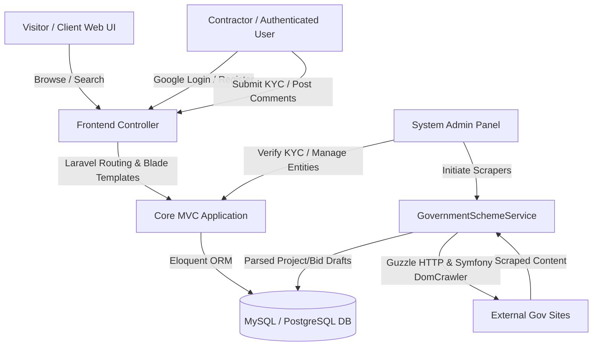
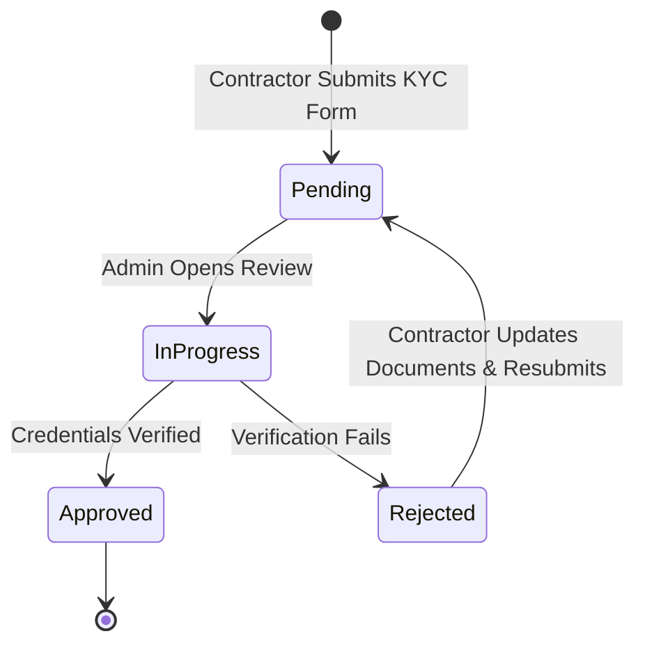
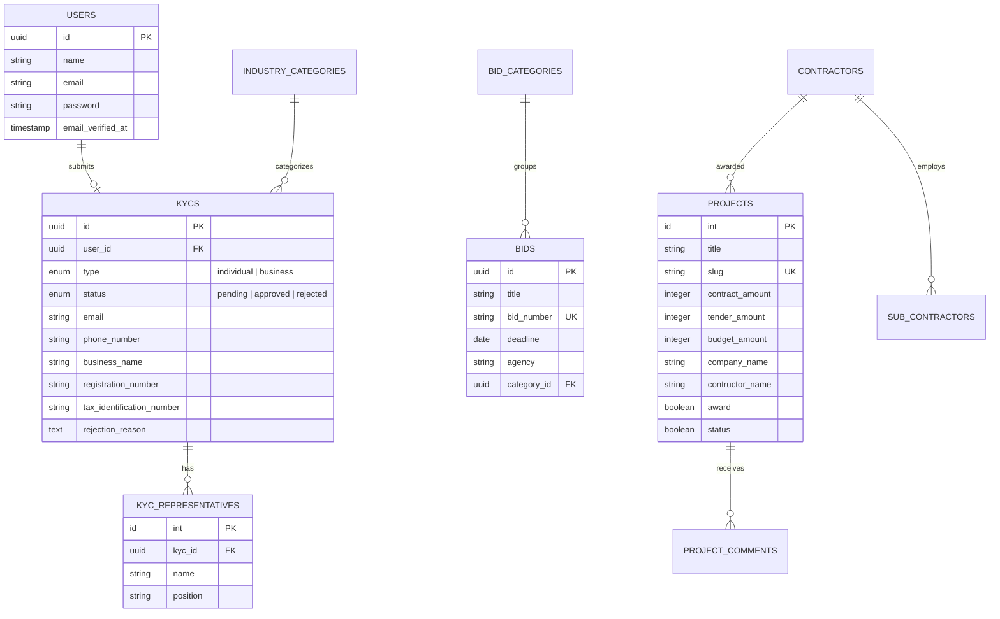

# Product Requirement Document (PRD)
## Project Name: OpenContracting
**Status:** Draft / Initial Specification  
**Target Platform:** Web App (Laravel, Blade, Tailwind CSS)  
**Author:** AI Coding Assistant (Antigravity)  

---

## 1. Executive Summary & Vision

### 1.1 Problem Statement
Government contracts and projects drive massive growth and economic development. However, access to contract opportunities is often fragmented, compliance checks are cumbersome, and transparency regarding who wins contracts and how budgets are spent is limited. Businesses, particularly SMEs (Small and Medium Enterprises), find it challenging to navigate public procurement opportunities, verify their credentials, and collaborate with prime contractors.

### 1.2 Product Vision
**OpenContracting** is a centralized platform designed to partner businesses with government projects, driving economic growth and development. It increases transparency and efficiency by providing a unified portal to:
1. **Discover** active government bids, tenders, and awarded projects.
2. **Onboard & Verify** businesses and individuals through a robust KYC (Know Your Customer) compliance workflow.
3. **Facilitate Collaboration** between prime contractors and subcontractors.
4. **Visualize Data** to track budget allocation, project distributions, and procurement analytics.
5. **Scrape & Aggregate** procurement listings from external public sources automatically.

---

## 2. User Roles & Personas

The platform serves four primary user groups:

| Role | Description | Key Objectives |
| :--- | :--- | :--- |
| **Visitor / General Public** | Unauthenticated users browsing the site. | • Search for awarded contracts and active tenders. • View data visualizations (charts, budgets, categories). • View contractors and subcontractor networks. |
| **Contractor (Business / Individual)** | Authenticated users representing businesses or sole practitioners. | • Register and complete Individual or Business KYC verification. • Add representatives (for business accounts). • Explore tenders, verify eligibility, and submit comments. |
| **Subcontractor** | Entities partnered with or working under primary contractors. | • Get listed under verified contractors. • Gain visibility for joint venture or subcontracting opportunities. |
| **System Administrator** | Backend staff running the platform. | • Review and approve/reject KYC submissions. • Manage projects, sectors, bids, and bid categories. • Execute website scraping routines to import new tenders. |

---

## 3. Product Architecture & Technical Stack

### 3.1 Stack Breakdown
* **Core Framework:** Laravel (PHP)
* **Frontend Templates:** Blade Views, Tailwind CSS, Javascript, Livewire (optional components)
* **Authentication:** Laravel Fortify/Breeze + Socialite (Google OAuth redirect & callback)
* **Database:** Relational (MySQL/PostgreSQL) with UUID primary keys for compliance records (`kycs`, `bids`, etc.)
* **Scraping Engine:** Guzzle Client + Symfony DomCrawler (DOM parsing)

---

## 4. Key Functional Modules & Requirements

### 4.1 Authentication & Registration
* **Google Social Auth:** Users can register/login with Google.
* **Email Verification:** Email verification (`MustVerifyEmail`) is mandatory for security.
* **Role Redirection:** Seamless login routing between admin space (`/admin`) and client frontend.

### 4.2 KYC & Compliance Verification Workflow
All contractors must complete KYC before participating in specific operations. The KYC model splits into two branches:

#### KYC Data Specifications
* **Common Fields:** Email, Phone Number, Type (`individual` or `business`), Status (`pending`, `inprogress`, `approved`, `rejected`), Rejection Reason.
* **Individual KYC:**
  * First name, last name, date of birth, nationality.
  * Identity Type (e.g., passport, driver's license), ID number.
  * Residential address, mailing address.
  * Document Uploads: Identity Document, Proof of Address (stored with Cloudinary/local storage IDs).
* **Business KYC:**
  * Business name, registration number, business type, industry, registered address, business address.
  * Contact person name and email.
  * Tax Identification Number (TIN).
  * Document Uploads: Certificate of Incorporation, Memorandum & Articles of Association.
  * Multi-representative mapping (allows adding multiple board members/officers).

#### KYC Lifecycle State Machine

### 4.3 Bidding & Tenders Portal
Allows contractors to view procurement opportunities posted by government agencies.
* **Bid Listings:** View details like Bid Number, Agency, Deadline, Category, Eligibility Criteria, and Attachments.
* **Categories:** Organized by sectors (e.g., Construction, ICT, Health).
* **Deadline Enforcement:** Automatically display remaining time or label bids as closed post-deadline.

### 4.4 Projects & Contracts Directory
A public database of awarded contracts to foster transparency.
* **Project Details:** Project Title, Body/Description, Procuring Entity, Contractor Name, Contractor Origin, Value/Amount (Contract, Tender, and Budget), Year, Status, and Location.
* **Currency/Amount Formatting:** Dynamic presentation (e.g. 5,000,000 -> 5M) for readable UI elements.
* **Interactive Comments:** Visitors can submit reviews/comments on projects and contractors, creating a public feedback loop.
* **Global Search:** Fuzzy text search across project titles and descriptions.

### 4.5 Contractor & Subcontractor Directory
Tracks the relationships of major contractors with subcontractors.
* **Contractor Profiles:** Name, Role/Position, Avatar, and linked projects.
* **Subcontractor Profiles:** Nested association under primary contractor profiles.

### 4.6 Scraper Service (External Data Aggregator)
Admin tool to dynamically pull contract listings from external sites.
* **Custom Scraper UI:** Admins enter a Target URL and a CSS selector.
* **Scraper Service (`GovernmentSchemeService`):**
  * Downloads target page via Guzzle.
  * Uses Symfony DomCrawler to filter matching selectors.
  * Outputs parsed text array to let administrators save them as projects or bids.
  * Caching implementation (`Cache::remember`) is available to reduce external traffic.

### 4.7 Visuals & Analytics Dashboard
Rich charts visualizing procurement activities over the last 12 months:
1. **Total Tenders vs. Awards vs. Contracts Amount:** Aggregate financial analytics.
2. **Budget Trend by Month:** Bar/line charts representing monthly spending.
3. **Projects by Category:** Doughnut chart breaking down sectors (e.g., Energy vs. Education).
4. **Projects by Award Status:** Awarded vs. Pending ratios.

---

## 5. Database Schema Details

---

## 6. Non-Functional & Quality Requirements

* **Performance:** Use Laravel query optimizations and Caching strategies (`Cache::remember`) to ensure visual analytics load in under 1.5 seconds.
* **Security:** Use UUIDs for public compliance data URLs to prevent enumeration attacks; sanitize all rich-text input (`project_comments`, project bodies).
* **SEO Best Practices:** Unique metadata titles and descriptions on detail pages, crawlable routing, and semantic HTML (`<h1>` hierarchy, `<article>`).
* **Design & Aesthetics:** Modern Dark/Glassmorphism theme interfaces with custom graphs (e.g., Chart.js) and hover animations to make public metrics engaging and premium.

---

## 7. Next Steps & Implementation Roadmap

1. **Phase 1: Compliance (KYC) Review Enhancement**
   * Connect KYC model statuses directly to user access gates (e.g., block bidding on active tenders unless KYC status is `approved`).
2. **Phase 2: Scraper Automation**
   * Enhance `GovernmentSchemeService` to map crawled elements directly into Project/Bid drafts instead of raw text. Set up cron scheduler to auto-pull weekly.
3. **Phase 3: Subcontractor Networking**
   * Implement a front-facing registration dashboard where Subcontractors can request association with registered Contractors.
